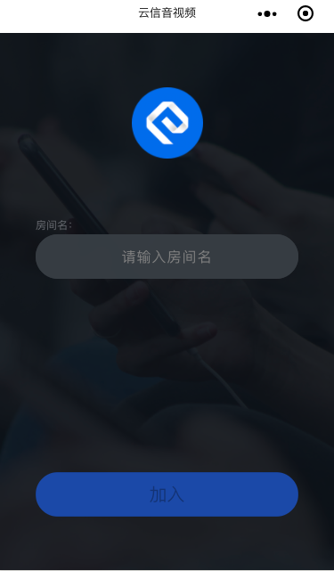

# NIM_Web_Weapp_NRTC
本实例为展示网易云信小程序音视频NRTC SDK能力。

请将`weappProject`文件夹导入至微信开发者工具，然后前往[官网](http://netease.im/)开通音视频小程序SDK业务，在管理后台中获取appkey，然后修改本项目中的 `pages/room/room.js` 如下代码，将appkey填入即可

```js
let netcall = Netcall.getInstance({ 
  debug: false,
  appkey: '此处请填写你开通的appkey'
})
```
加入前：



加入后：

